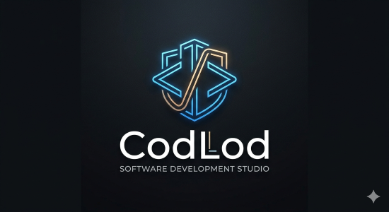

  

# CodLod — Official Web Presence

**🌐 Visit us: [codlod.com](http://codlod.com)**

Official website and portfolio of **[CodLod Software Development Studio](http://codlod.com)**. This repository contains the source code for our digital home, showcasing our expertise in building high-performance web applications.

## 🛠 Tech Stack

* **Framework:** [Next.js](https://nextjs.org/) (App Router)
* **Styling:** [Tailwind CSS](https://tailwindcss.com/)
* **Language:** TypeScript
* **Deployment:** [Vercel](https://vercel.com/)

## 🚀 Key Features

* **Performance First:** Optimized for Core Web Vitals.
* **Modern UI:** Responsive design with a focus on "clean code" and professional aesthetics.
* **Dark Theme:** Native dark mode support for an eye-friendly experience.
* **SEO Optimized:** Built with search engine visibility in mind.

## 🛠 Getting Started
